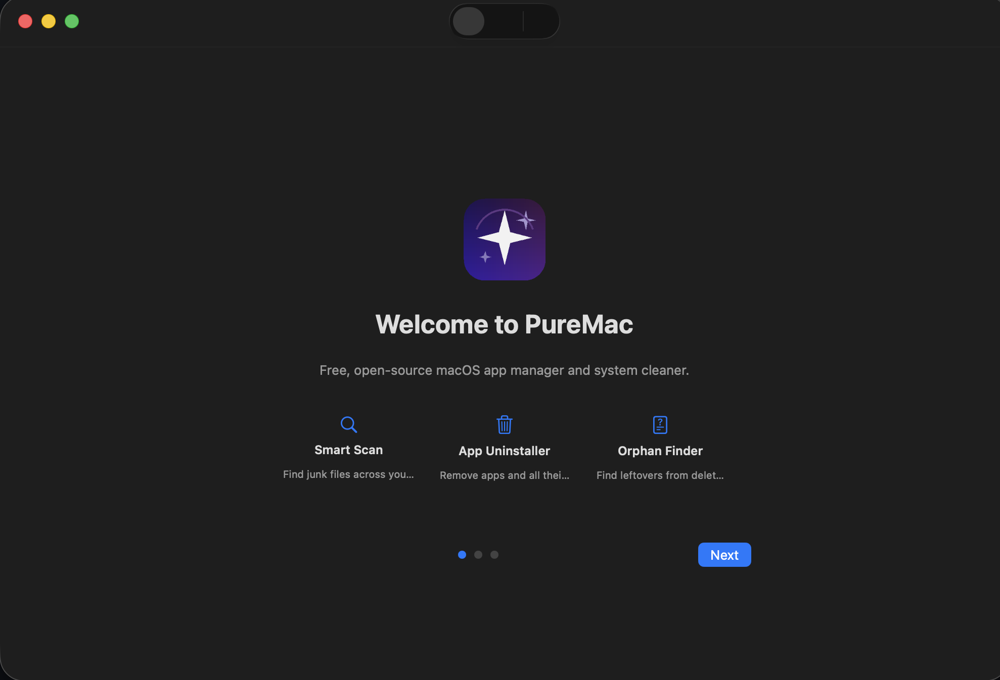
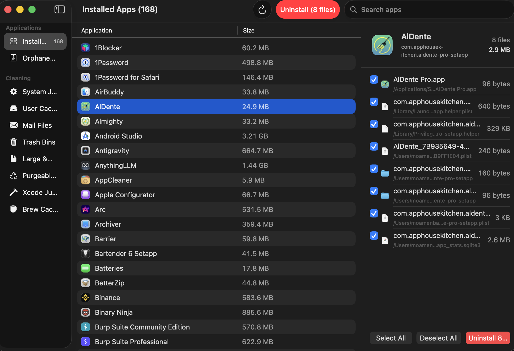
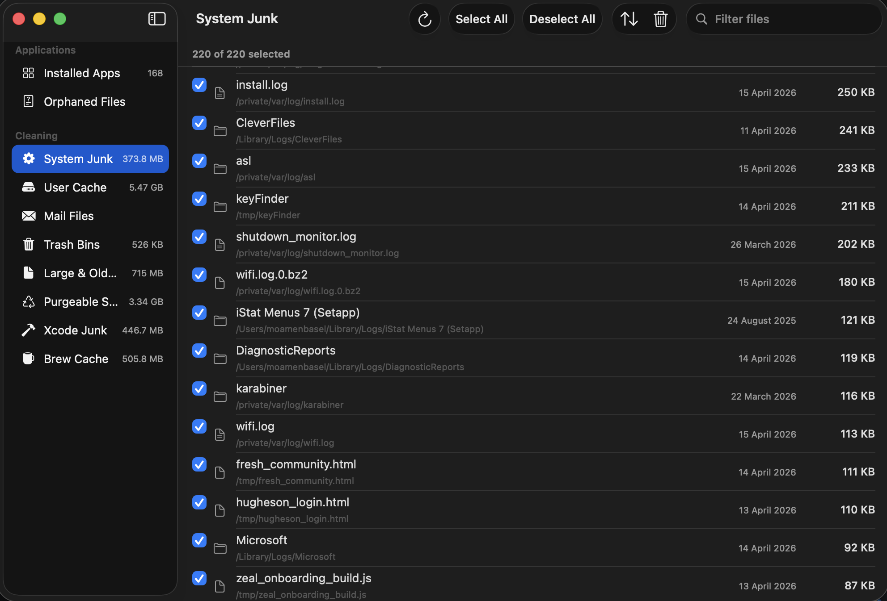

<p align="center">
  
</p>

<p align="center">
  <b>English</b> |
  <a href="docs/README.es.md">Español</a> |
  <a href="docs/README.ja.md">日本語</a> |
  <a href="docs/README.zh-Hans.md">简体中文</a> |
  <a href="docs/README.zh-Hant.md">繁體中文</a>
</p>

<h1 align="center">PureMac</h1>

<p align="center">
  <b>Free, open-source macOS app manager and system cleaner.</b><br>
  Uninstall apps completely. Find orphaned files. Clean system junk.<br>
  No subscriptions. No telemetry. No data collection.
</p>

<p align="center">
  <a href="https://github.com/momenbasel/PureMac/releases/latest"></a>
  <a href="https://github.com/momenbasel/PureMac/actions/workflows/build.yml"></a>
  
  
  <a href="LICENSE"></a>
  <a href="https://github.com/momenbasel/PureMac/stargazers"></a>
  <a href="https://github.com/momenbasel/PureMac/releases"></a>
</p>

<p align="center">
  <a href="#install">Install</a> -
  <a href="#features">Features</a> -
  <a href="#screenshots">Screenshots</a> -
  <a href="#contributing">Contributing</a>
</p>

---

## Install

### Homebrew (recommended)

```bash
brew update
brew install --cask puremac
```

### Direct Download

Download the latest `.dmg` from [Releases](https://github.com/momenbasel/PureMac/releases/latest), open it, and drag PureMac to `/Applications`.

> Signed and notarized with Apple Developer ID - installs without Gatekeeper warnings.

### Build from source

```bash
brew install xcodegen
git clone https://github.com/momenbasel/PureMac.git
cd PureMac
xcodegen generate
xcodebuild -project PureMac.xcodeproj -scheme PureMac -configuration Release -derivedDataPath build build
open build/Build/Products/Release/PureMac.app
```

## Features

### App Uninstaller
- Discovers all installed apps from `/Applications` and `~/Applications`
- Heuristic file discovery engine with **10-level matching** (bundle ID, company name, entitlements, team identifier, Spotlight metadata, container discovery)
- **3 sensitivity levels**: Strict (safe), Enhanced (balanced), Deep (thorough)
- Shows all related files: caches, preferences, containers, logs, support files, launch agents
- System app protection - 27 Apple apps are excluded from the uninstall list
- Master-detail view: app table on left, discovered files on right

### Orphaned File Finder
- Detects leftover files in `~/Library` from apps that have been uninstalled
- Compares Library contents against all installed app identifiers
- One-click cleanup of orphaned files

### System Cleaner
- **Smart Scan** - one-click scan across all categories
- **System Junk** - system caches, logs, and temporary files
- **System Data** - opt-in cleanup for local iPhone/iPad backups, completed macOS installers, and mobile software updates
- **User Cache** - dynamically discovers all app caches (no hardcoded app list)
- **Mail Attachments** - downloaded mail attachments
- **Trash Bins** - empty all Trash
- **Large & Old Files** - files over 100 MB or older than 1 year
- **Purgeable Space** - APFS purgeable disk space detection
- **Xcode Junk** - DerivedData, Archives, simulator caches
- **Visual Studio Junk** - `bin` and `obj` build outputs from .NET projects
- **Brew Cache** - Homebrew download cache (detects custom HOMEBREW_CACHE)
- **Scheduled Cleaning** - automatic scans on configurable intervals

### Native macOS Experience
- Built with SwiftUI using native macOS components
- `NavigationSplitView`, `Toggle`, `ProgressView`, `Form`, `GroupBox`, `Table`
- Respects system light/dark mode automatically
- No custom gradients, glows, or web-app styling
- First-launch onboarding with Full Disk Access setup

### Safety
- Confirmation dialogs before all destructive operations
- Symlink attack prevention - resolves and validates paths before deletion
- System app protection - Apple apps cannot be uninstalled
- Large & Old Files are never auto-selected
- System Data backups and installers are detected but not auto-selected
- Structured logging via `os.log` (visible in Console.app)

## Screenshots

| Onboarding | App Uninstaller |
|---|---|
|  |  |

| System Junk | Xcode Junk |
|---|---|
|  |  |

| User Cache |
|---|
|  |

## Architecture

```
PureMac/
  Logic/Scanning/     - Heuristic scan engine, locations database, conditions
  Logic/Utilities/    - Structured logging and GUI CLI entry helpers
  Models/             - Data models, typed errors
  Services/           - Scan engine, cleaning engine, scheduler
  ViewModels/         - Centralized app state
  Views/              - Native SwiftUI views
    Apps/             - App uninstaller views
    Cleaning/         - Smart scan and category views
    Orphans/          - Orphan finder
    Settings/         - Native Form-based settings
    Components/       - Shared components
PureMacCLI/           - JSON-first first-party CLI for OpenClaw/Hermes host maintenance
manifests/            - First-party tool discovery manifests
```

Key components:
- **AppPathFinder** - 10-level heuristic matching engine for discovering app-related files
- **Locations** - 120+ macOS filesystem search paths
- **Conditions** - 25 per-app matching rules for edge cases (Xcode, Chrome, VS Code, etc.)
- **AppInfoFetcher** - Spotlight metadata + Info.plist fallback for app discovery
- **Logger** - Apple `os.log` unified logging

### GUI scheduling

1. Open **Settings** (gear icon or Cmd+,)
2. Go to the **Schedule** tab
3. Enable **Automatic Cleaning**
4. Choose your interval: hourly / 3h / 6h / 12h / daily / weekly / biweekly / monthly
5. Optionally enable **Auto-clean after scan** and **Auto-purge purgeable space**

### First-party CLI for OpenClaw and Hermes

PureMac also builds `puremaccli`, a JSON-first command-line tool intended for headless host maintenance by OpenClaw and Hermes. It is intentionally simple: a stable manifest and JSON command output, not a plugin runtime.

Build it from source:

```bash
xcodegen generate
xcodebuild -project PureMac.xcodeproj -scheme puremaccli -configuration Debug -derivedDataPath build build
```

Useful commands:

```bash
# Check the 10% free-space success criterion
build/Build/Products/Debug/puremaccli status --home /Users/mike --min-free-percent 10 --json

# Dry-run safe Visual Studio/.NET build artifact cleanup under project roots
build/Build/Products/Debug/puremaccli clean \
  --home /Users/mike \
  --root /Users/mike/Projects \
  --min-free-percent 10 \
  --dry-run \
  --json

# Execute only after reviewing dry-run JSON
build/Build/Products/Debug/puremaccli clean \
  --home /Users/mike \
  --root /Users/mike/Projects \
  --min-free-percent 10 \
  --execute \
  --json \
  --log-dir /Users/mike/Library/Logs/PureMac/cleanup-runs
```

The first-party contract lives at `manifests/puremaccli.manifest.json`. Current CLI cleanup is conservative and focuses on safe `.NET/Visual Studio` project build outputs (`bin` and `obj`) only when a nearby project marker such as `.csproj`, `.sln`, `Directory.Build.props`, or `global.json` proves build context. It also includes developer package caches such as `~/.nuget/packages`, npm/pip/yarn/pnpm caches, Homebrew cache, and immediate user cache entries under `~/Library/Caches` / `~/.cache` when disk pressure is below the configured threshold.

## What Gets Cleaned

| Category | Paths |
|---|---|
| System Junk | `/Library/Caches`, `/Library/Logs`, `/tmp`, `~/Library/Logs` |
| System Data | iOS device backups, completed macOS installers, mobile software updates |
| User Cache | `~/Library/Caches`, npm/pip/yarn/pnpm caches |
| Mail Attachments | `~/Library/Mail Downloads` |
| Trash | `~/.Trash` |
| Large Files | `~/Downloads`, `~/Documents`, `~/Desktop` (>100MB or >1yr old) |
| Purgeable | Time Machine local snapshots via `tmutil` |
| Xcode | `DerivedData`, `Archives`, `CoreSimulator/Caches` |
| Visual Studio | `.NET` `bin` and `obj` build outputs |
| Homebrew | `~/Library/Caches/Homebrew` |

## Safety

- Never deletes system-critical files
- Only removes caches, logs, temporary files, and user-selected items
- Large & Old Files are **not auto-selected** - you choose what to remove
- System Data backups and installers are detected but not auto-selected
- All operations are non-destructive to the operating system
- Symlink attack prevention resolves and validates paths before deletion
- Purgeable space uses only Time Machine snapshots, not actual free space


## Contributing

Contributions are welcome. See [CONTRIBUTING.md](CONTRIBUTING.md) for guidelines.

Areas where help is especially welcome:
- Size/date filter presets in category views
- XCTest coverage for AppState and scan engine
- Localization (zh-Hans, zh-Hant, and other languages)
- App icon design

## Acknowledgments

v2.0 was shaped by community feedback and contributions:

- **[@nguyenhuy158](https://github.com/nguyenhuy158)** - Search and filter feature request ([#18](https://github.com/momenbasel/PureMac/issues/18)) and implementation ([#29](https://github.com/momenbasel/PureMac/pull/29))
- **[@edufalcao](https://github.com/edufalcao)** - Cleaning safety guards and confirmation dialogs ([#30](https://github.com/momenbasel/PureMac/pull/30))
- **[@zeck00](https://github.com/zeck00)** - UI overhaul ([#31](https://github.com/momenbasel/PureMac/pull/31)), app uninstaller with system app protection ([#32](https://github.com/momenbasel/PureMac/pull/32)), and onboarding experience ([#33](https://github.com/momenbasel/PureMac/pull/33))
- **[@0x-man](https://github.com/0x-man)** - Symlink security vulnerability report ([#25](https://github.com/momenbasel/PureMac/issues/25))
- **[@ansidev](https://github.com/ansidev)** - Checkbox interaction bug report ([#34](https://github.com/momenbasel/PureMac/issues/34))
- **[@fengcheng01](https://github.com/fengcheng01)** - App uninstaller feature request ([#28](https://github.com/momenbasel/PureMac/issues/28))
- **[@scholzfuni](https://github.com/scholzfuni)** - Modularization proposal ([#23](https://github.com/momenbasel/PureMac/issues/23))

## License

MIT License. See [LICENSE](LICENSE) for details.
